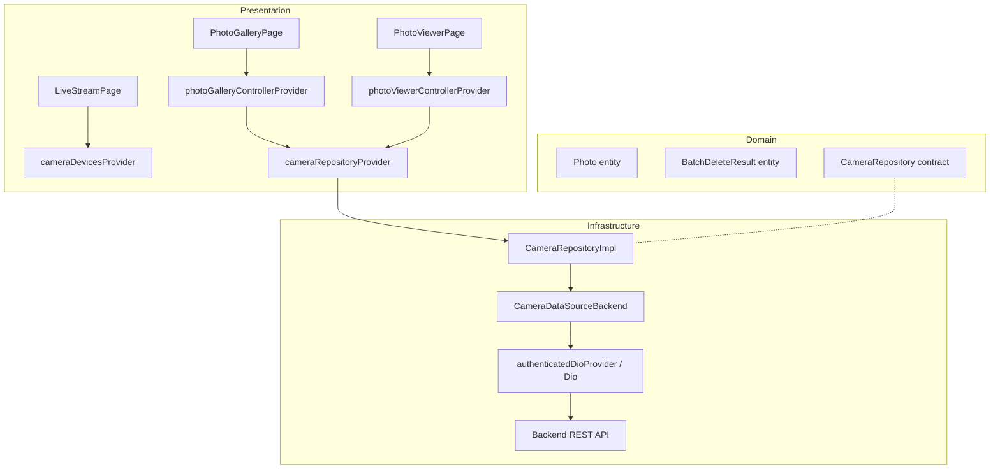

# Design Document: Camera Gallery

## Overview

This feature adds a camera gallery module to the plant monitoring dashboard, enabling users to browse captured photos in a paginated grid, view individual photos at full size, trigger on-demand captures, delete photos (individually or in batch), and watch a live MJPEG stream from camera devices.

The design follows the existing clean architecture (domain → infrastructure → presentation) with the Repository + DataSource pattern, Riverpod for state management, go_router for navigation, and dio for HTTP communication. It reuses the existing `PaginatedResponse<T>` model and `authenticatedDioProvider` for authenticated requests.

## Architecture



### Data Flow

1. **Gallery load**: `PhotoGalleryPage` watches `photoGalleryControllerProvider` → controller calls `CameraRepository.getPhotos()` → `CameraRepositoryImpl` delegates to `CameraDataSourceBackend.fetchPhotos()` → Dio GET `/cameras/photos` → JSON response parsed into `PaginatedResponse<PhotoDto>` → DTOs mapped to `Photo` entities → state emitted to UI.

2. **Photo capture**: User presses Capture → controller calls `CameraRepository.capturePhoto(deviceId)` → POST `/cameras/{device_id}/capture` → returned `PhotoDto` mapped to `Photo` → controller invalidates gallery state to reload.

3. **Batch delete**: User selects photos → controller calls `CameraRepository.deletePhotos(ids)` → DELETE `/cameras/photos` with body → `BatchDeleteResultDto` mapped to `BatchDeleteResult` → controller invalidates gallery state.

4. **MJPEG stream**: `LiveStreamPage` obtains the stream URL via `CameraRepository.getStreamUrl(deviceId)` → URL constructed locally (no HTTP call) → rendered in an HTML `` element via `HtmlElementView` with JWT token appended as query parameter.

## Components and Interfaces

### Domain Layer

| File | Type | Responsibility |
|------|------|----------------|
| `domain/entities/photo.dart` | Entity | Pure domain model for photo metadata |
| `domain/entities/batch_delete_result.dart` | Entity | Result of batch delete operation |
| `domain/repositories/camera_repository.dart` | Abstract class | Contract for all camera operations |

### Infrastructure Layer

| File | Type | Responsibility |
|------|------|----------------|
| `infrastructure/models/photo_dto.dart` | DTO | JSON serialization + `toEntity()` mapping |
| `infrastructure/models/batch_delete_result_dto.dart` | DTO | JSON serialization + `toEntity()` mapping |
| `infrastructure/datasources/camera/camera_datasource.dart` | Abstract class | DataSource contract (HTTP-agnostic) |
| `infrastructure/datasources/camera/camera_datasource_backend.dart` | Concrete class | REST implementation using Dio |
| `infrastructure/repositories/camera_repository_impl.dart` | Concrete class | Maps DTOs to entities, delegates to datasource |

### Presentation Layer

| File | Type | Responsibility |
|------|------|----------------|
| `presentation/providers/camera/camera_providers.dart` | Providers | `cameraDataSourceProvider`, `cameraRepositoryProvider`, `cameraDevicesProvider` |
| `presentation/providers/camera/photo_gallery_controller.dart` | AsyncNotifier | Gallery state: paginated photos, filters, capture, delete |
| `presentation/providers/camera/photo_gallery_state.dart` | State model | Holds items, total, offset, limit, filter, isLoadingMore |
| `presentation/providers/camera/photo_gallery_filter.dart` | Filter model | deviceId, from, to |
| `presentation/providers/camera/photo_viewer_controller.dart` | AsyncNotifier.family | Single photo state + delete |
| `presentation/pages/camera/photo_gallery_page.dart` | Widget | Grid gallery with filters, pagination, selection mode |
| `presentation/pages/camera/photo_viewer_page.dart` | Widget | Full-size photo view with metadata and delete |
| `presentation/pages/camera/live_stream_page.dart` | Widget | MJPEG stream via HtmlElementView |
| `presentation/router/app_routes.dart` | Constants | New route constants for `/camaras`, `/camaras/foto/:id`, `/camaras/stream/:deviceId` |

### Interfaces

```dart
// domain/repositories/camera_repository.dart
abstract class CameraRepository {
  Future<PaginatedResponse<Photo>> getPhotos({
    String? deviceId,
    DateTime? from,
    DateTime? to,
    int limit = 20,
    int offset = 0,
  });
  Future<Photo> getPhotoMetadata(String photoId);
  String getPhotoDownloadUrl(String photoId);
  Future<Photo> capturePhoto(String deviceId);
  Future<void> deletePhoto(String photoId);
  Future<BatchDeleteResult> deletePhotos(List<String> photoIds);
  String getStreamUrl(String deviceId);
}
```

```dart
// infrastructure/datasources/camera/camera_datasource.dart
abstract class CameraDataSource {
  Future<PaginatedResponse<PhotoDto>> fetchPhotos({
    String? deviceId,
    DateTime? from,
    DateTime? to,
    int? limit,
    int? offset,
  });
  Future<PhotoDto> fetchPhotoMetadata(String photoId);
  String getPhotoDownloadUrl(String photoId);
  Future<PhotoDto> capturePhoto(String deviceId);
  Future<void> deletePhoto(String photoId);
  Future<BatchDeleteResultDto> deletePhotos(List<String> photoIds);
  String getStreamUrl(String deviceId);
}
```

## Data Models

### Photo (Domain Entity)

```dart
class Photo {
  final String id;
  final String deviceId;
  final String filename;
  final String filepath;
  final int sizeBytes;
  final String contentType;
  final DateTime capturedAt;
  final DateTime createdAt;

  const Photo({
    required this.id,
    required this.deviceId,
    required this.filename,
    required this.filepath,
    required this.sizeBytes,
    required this.contentType,
    required this.capturedAt,
    required this.createdAt,
  });
}
```

### BatchDeleteResult (Domain Entity)

```dart
class BatchDeleteResult {
  final int deletedCount;
  final List<String> notFoundIds;

  const BatchDeleteResult({
    required this.deletedCount,
    required this.notFoundIds,
  });
}
```

### PhotoDto (Infrastructure)

```dart
class PhotoDto {
  final String id;
  final String deviceId;
  final String filename;
  final String filepath;
  final int sizeBytes;
  final String contentType;
  final String capturedAt;  // ISO 8601 string
  final String createdAt;   // ISO 8601 string

  const PhotoDto({...});

  factory PhotoDto.fromJson(Map<String, dynamic> json) => PhotoDto(
    id: json['id'] as String,
    deviceId: json['device_id'] as String,
    filename: json['filename'] as String,
    filepath: json['filepath'] as String,
    sizeBytes: json['size_bytes'] as int,
    contentType: json['content_type'] as String,
    capturedAt: json['captured_at'] as String,
    createdAt: json['created_at'] as String,
  );

  Map<String, dynamic> toJson() => {
    'id': id,
    'device_id': deviceId,
    'filename': filename,
    'filepath': filepath,
    'size_bytes': sizeBytes,
    'content_type': contentType,
    'captured_at': capturedAt,
    'created_at': createdAt,
  };

  Photo toEntity() => Photo(
    id: id,
    deviceId: deviceId,
    filename: filename,
    filepath: filepath,
    sizeBytes: sizeBytes,
    contentType: contentType,
    capturedAt: DateTime.parse(capturedAt),
    createdAt: DateTime.parse(createdAt),
  );
}
```

### BatchDeleteResultDto (Infrastructure)

```dart
class BatchDeleteResultDto {
  final int deletedCount;
  final List<String> notFoundIds;

  const BatchDeleteResultDto({...});

  factory BatchDeleteResultDto.fromJson(Map<String, dynamic> json) =>
    BatchDeleteResultDto(
      deletedCount: json['deleted_count'] as int,
      notFoundIds: (json['not_found_ids'] as List<dynamic>)
          .map((e) => e as String).toList(),
    );

  BatchDeleteResult toEntity() => BatchDeleteResult(
    deletedCount: deletedCount,
    notFoundIds: notFoundIds,
  );
}
```

### PhotoGalleryState (Presentation)

```dart
class PhotoGalleryState {
  final List<Photo> items;
  final int total;
  final int limit;  // 20
  final int offset;
  final PhotoGalleryFilter filter;
  final bool isLoadingMore;
  final Set<String> selectedIds;  // for batch selection mode
  final bool isSelectionMode;

  bool get hasMore => offset + items.length < total;
}
```

### PhotoGalleryFilter (Presentation)

```dart
class PhotoGalleryFilter {
  final String? deviceId;
  final DateTime? from;
  final DateTime? to;

  const PhotoGalleryFilter({this.deviceId, this.from, this.to});
}
```

### Route Constants

```dart
// Added to AppRoutes
static const cameras = '/camaras';
static const cameraPhoto = '/camaras/foto/:id';
static const cameraStream = '/camaras/stream/:deviceId';
```

### Provider Wiring

```dart
// camera_providers.dart
final cameraDataSourceProvider = Provider<CameraDataSource>((ref) {
  final dio = ref.watch(authenticatedDioProvider);
  return CameraDataSourceBackend(dio);
});

final cameraRepositoryProvider = Provider<CameraRepository>((ref) {
  return CameraRepositoryImpl(ref.watch(cameraDataSourceProvider));
});

final cameraDevicesProvider = Provider<List<Device>>((ref) {
  final devicesAsync = ref.watch(devicesControllerProvider);
  return devicesAsync.valueOrNull
      ?.where((d) => d.type == DeviceType.camera)
      .toList() ?? [];
});
```


## Correctness Properties

*A property is a characteristic or behavior that should hold true across all valid executions of a system — essentially, a formal statement about what the system should do. Properties serve as the bridge between human-readable specifications and machine-verifiable correctness guarantees.*

### Property 1: PhotoDto serialization round-trip

*For any* valid `PhotoDto` instance (with non-empty string fields and valid ISO 8601 date strings for `capturedAt` and `createdAt`), calling `toJson()` and then `PhotoDto.fromJson()` on the result SHALL produce a `PhotoDto` with field values identical to the original.

**Validates: Requirements 1.2, 1.3, 1.4, 1.5**

### Property 2: PhotoDto rejects invalid JSON

*For any* JSON map that is missing at least one required field (`id`, `device_id`, `filename`, `filepath`, `size_bytes`, `content_type`, `captured_at`, `created_at`) or contains a value of incorrect type for any required field, `PhotoDto.fromJson()` SHALL throw an error.

**Validates: Requirements 1.6**

### Property 3: BatchDeleteResultDto parse-to-entity preserves data

*For any* valid JSON object containing a non-negative `deleted_count` (≤ 50) and a `not_found_ids` list of UUID strings (≤ 50 elements), parsing via `BatchDeleteResultDto.fromJson()` and then calling `toEntity()` SHALL produce a `BatchDeleteResult` whose `deletedCount` equals the original `deleted_count` value and whose `notFoundIds` list is element-wise equal to the original `not_found_ids` array.

**Validates: Requirements 2.2, 2.4**

### Property 4: BatchDeleteResultDto rejects invalid JSON

*For any* JSON map that is missing `deleted_count` or `not_found_ids`, or where `deleted_count` is not an integer, or where `not_found_ids` is not a list, `BatchDeleteResultDto.fromJson()` SHALL throw a `FormatException`.

**Validates: Requirements 2.3**

### Property 5: URL construction correctness

*For any* non-empty `photoId` string and any non-empty `deviceId` string, `getPhotoDownloadUrl(photoId)` SHALL produce a URL string ending with `/cameras/photos/{photoId}/file`, and `getStreamUrl(deviceId)` SHALL produce a URL string ending with `/cameras/{deviceId}/stream`. Furthermore, when a JWT token is appended as a `token` query parameter for streaming, the resulting URL SHALL contain `?token={jwt}` or `&token={jwt}`.

**Validates: Requirements 3.10, 3.14, 10.2**

### Property 6: Pagination hasMore invariant

*For any* `PhotoGalleryState` with `total`, `offset`, and `items` of length `n`, the `hasMore` getter SHALL return `true` if and only if `offset + n < total`.

**Validates: Requirements 5.7**

### Property 7: File size formatting

*For any* non-negative integer `sizeBytes`, the human-readable formatting function SHALL produce a string ending in "KB" when `sizeBytes < 1_048_576` (displaying `sizeBytes / 1024` rounded to one decimal), or ending in "MB" otherwise (displaying `sizeBytes / 1_048_576` rounded to one decimal).

**Validates: Requirements 6.2**

### Property 8: Applying filters resets offset to zero

*For any* `PhotoGalleryState` with an arbitrary current `offset` and any new `PhotoGalleryFilter`, calling `applyFilters(filter)` on the gallery controller SHALL produce a new state with `offset == 0` and the provided filter values active.

**Validates: Requirements 5.3, 11.3**

### Property 9: Load more appends items and advances offset

*For any* `PhotoGalleryState` where `hasMore` is true, calling `loadMore()` SHALL produce a state whose `items` list starts with all previous items followed by the new batch, and whose `offset` equals the previous `offset + previous items.length`.

**Validates: Requirements 5.6, 11.3**

### Property 10: Camera devices filter returns only camera-type devices

*For any* list of `Device` instances with mixed `DeviceType` values (sensor, camera, irrigation), the `cameraDevicesProvider` filtering logic SHALL return a list containing exactly those devices whose `type == DeviceType.camera`, preserving their order.

**Validates: Requirements 11.7**

## Error Handling

### Error Propagation Strategy

Errors are handled at two levels:

1. **DataSource layer** — Catches Dio exceptions and maps them to domain failures:
   - `DioException` with status 404 → `NotFoundFailure`
   - `DioException` with connection error → `NetworkFailure`
   - Other `DioException` → `ServerFailure` with status code and message

2. **Presentation layer** — Controllers catch failures and expose them via `AsyncValue.error`:
   - UI uses `.when(data:, error:, loading:)` to display appropriate feedback
   - Error states include a retry mechanism (retry button or pull-to-refresh)

### Specific Error Scenarios

| Scenario | Source | Handling |
|----------|--------|----------|
| Photo not found (404) | DataSource | `NotFoundFailure` → UI shows "Photo not found" with back navigation |
| Network unavailable | DataSource | `NetworkFailure` → UI shows "No connection" with retry button |
| Capture timeout (30s) | Controller | Dio `CancelToken` cancels request → UI shows timeout error notification |
| Batch delete with invalid count | DataSource | `ArgumentError` thrown before network call (input validation) |
| Stream unavailable | LiveStreamPage | HTML img error event → UI shows "Stream unavailable" with retry |
| Partial batch delete (some not found) | Controller | Success path: UI shows deleted count + lists not-found IDs in notification |

### Timeout Configuration

- Photo capture: 30-second timeout using Dio `CancelToken` with timer
- Stream error detection: 10-second initial load timeout in LiveStreamPage
- Standard API calls: default Dio timeout (no custom override)

## Testing Strategy

### Unit Tests (Example-Based)

Focus on specific scenarios and edge cases:

- **Entity construction**: Verify `Photo` and `BatchDeleteResult` hold correct field values
- **Interface compliance**: Ensure abstract classes define expected method signatures (compile-time)
- **Date formatting**: Verify `dd/MM/yyyy HH:mm` output for known DateTime values
- **Widget tests**: Verify UI components render correctly for loading, error, empty, and data states
- **Router tests**: Verify auth guard redirects unauthenticated users from `/camaras` routes
- **Controller tests**: Verify capture success prepends photo, delete removes photo from state
- **Edge cases**: Batch delete with 0 items throws, batch delete with 51 items throws, selection capped at 50

### Property-Based Tests

Using the `fast_check` Dart package (or `glados` as alternative) with minimum 100 iterations per property.

Each property test must reference the design property and follow this tag format:
**Feature: camera-gallery, Property {number}: {property_text}**

Properties to implement:
1. PhotoDto round-trip serialization
2. PhotoDto fromJson invalid input rejection
3. BatchDeleteResultDto parse-to-entity data preservation
4. BatchDeleteResultDto invalid JSON rejection
5. URL construction correctness (download + stream + token)
6. Pagination hasMore invariant
7. File size formatting
8. Filters reset offset to zero
9. Load more appends and advances offset
10. Camera device type filtering

### Integration Tests

Using mocked Dio to verify HTTP layer wiring:

- `CameraDataSourceBackend` calls correct endpoints with correct HTTP methods
- Query parameters are serialized correctly (ISO 8601 dates, pagination params)
- Error status codes are mapped to correct failure types
- `CameraRepositoryImpl` delegates correctly and maps DTOs to entities

### Test Organization

```
test/
  unit/
    infrastructure/models/
      photo_dto_test.dart            # Properties 1, 2
      batch_delete_result_dto_test.dart  # Properties 3, 4
    infrastructure/datasources/camera/
      camera_datasource_backend_test.dart  # Integration + Property 5
    presentation/providers/camera/
      photo_gallery_controller_test.dart   # Properties 6, 8, 9
      camera_providers_test.dart           # Property 10
    core/utils/
      file_size_formatter_test.dart        # Property 7
  widget/
    presentation/pages/camera/
      photo_gallery_page_test.dart
      photo_viewer_page_test.dart
      live_stream_page_test.dart
```
