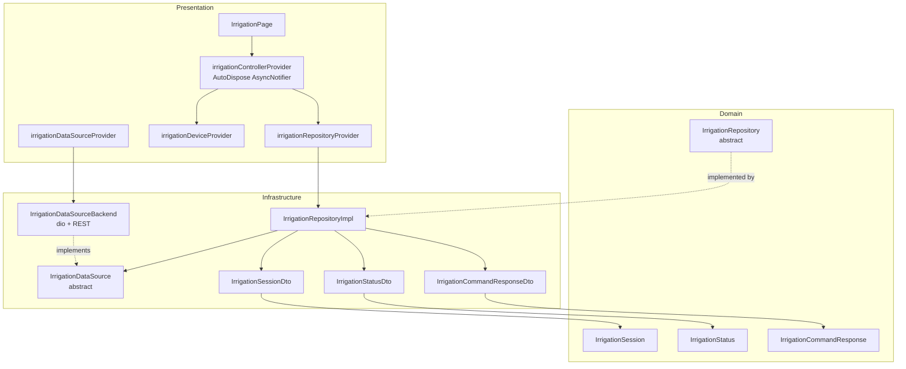

# Design Document — Irrigation Control

## Overview

Feature de control de riego que permite al usuario iniciar/detener el riego remotamente, ver estado en tiempo real con polling cada 10 segundos, consultar historial paginado de sesiones, y acceder al stream de cámara vinculada cuando está disponible.

El diseño sigue la arquitectura Clean Architecture + Repository/DataSource del proyecto existente, usando Riverpod sin codegen, dio para HTTP, y go_router para navegación.

### Decisiones clave de diseño

1. **Polling con Timer.periodic (no WebSocket):** El backend expone REST, no push. Un Timer.periodic de 10s en el controller es la forma más sencilla; el timer se cancela en `dispose` del autoDispose provider.
2. **Estado compuesto en un solo controller:** `irrigationControllerProvider` gestiona status, lastCommandResponse, historial, hasMore, y consecutiveFailureCount en un estado inmutable. Esto evita múltiples providers interdependientes y simplifica la sincronización.
3. **Resiliencia del polling:** Errores individuales de poll se tragan (mantienen el último status). 3 fallos consecutivos muestran indicador de datos obsoletos pero el polling sigue activo.
4. **Confirmación solo para start:** La acción de start activa una bomba de agua física. Un dialog previo previene activaciones accidentales. Stop no requiere confirmación (detener es siempre seguro).

## Architecture



### Flujo de datos

1. `IrrigationPage` consume `irrigationControllerProvider` vía `ref.watch`.
2. El controller obtiene `deviceId` de `irrigationDeviceProvider` (que filtra desde `devicesControllerProvider`).
3. En `build()`, el controller lanza `fetchStatus` y `fetchHistory` concurrentes usando `Future.wait`.
4. Un `Timer.periodic(10s)` arranca tras el build exitoso; cada tick llama `fetchStatus` y actualiza el estado.
5. Comandos start/stop delegan al repository, guardan la respuesta, y fuerzan un status refresh inmediato reseteando el timer.

## Components and Interfaces

### Domain Layer

#### Entities

```dart
// domain/entities/irrigation_session.dart
class IrrigationSession {
  final String id;
  final String deviceId;
  final DateTime startedAt;
  final DateTime? endedAt;
  final int? durationSeconds;
  final String? stopReason;

  const IrrigationSession({
    required this.id,
    required this.deviceId,
    required this.startedAt,
    this.endedAt,
    this.durationSeconds,
    this.stopReason,
  });
}
```

```dart
// domain/entities/irrigation_status.dart
class IrrigationStatus {
  final bool connected;
  final bool irrigating;
  final DateTime? sessionStartedAt;

  const IrrigationStatus({
    required this.connected,
    required this.irrigating,
    this.sessionStartedAt,
  });
}
```

```dart
// domain/entities/irrigation_command_response.dart
class IrrigationCommandResponse {
  final String status; // "started" | "stopped"
  final String? cameraDeviceId;
  final bool cameraStreamingAvailable;

  const IrrigationCommandResponse({
    required this.status,
    this.cameraDeviceId,
    required this.cameraStreamingAvailable,
  });
}
```

#### Repository Contract

```dart
// domain/repositories/irrigation_repository.dart
abstract class IrrigationRepository {
  Future<IrrigationCommandResponse> startIrrigation(String deviceId);
  Future<IrrigationCommandResponse> stopIrrigation(String deviceId);
  Future<IrrigationStatus> getStatus(String deviceId);
  Future<PaginatedResponse<IrrigationSession>> getHistory(
    String deviceId, {
    int limit = 20,
    int offset = 0,
  });
}
```

### Infrastructure Layer

#### DataSource Contract

```dart
// infrastructure/datasources/irrigation/irrigation_datasource.dart
abstract class IrrigationDataSource {
  Future<IrrigationCommandResponseDto> startIrrigation(String deviceId);
  Future<IrrigationCommandResponseDto> stopIrrigation(String deviceId);
  Future<IrrigationStatusDto> fetchStatus(String deviceId);
  Future<PaginatedResponse<IrrigationSessionDto>> fetchHistory(
    String deviceId, {
    required int limit,
    required int offset,
  });
}
```

#### DataSource Backend Implementation

```dart
// infrastructure/datasources/irrigation/irrigation_datasource_backend.dart
class IrrigationDataSourceBackend implements IrrigationDataSource {
  final Dio _dio;
  IrrigationDataSourceBackend(this._dio);

  // POST /irrigation/{device_id}/start
  // POST /irrigation/{device_id}/stop
  // GET  /irrigation/{device_id}/status
  // GET  /irrigation/{device_id}/history?limit=X&offset=Y
  //
  // Throws: ArgumentError (empty deviceId, invalid pagination),
  //         NotFoundFailure (404), SessionExpiredFailure (401),
  //         NetworkFailure (other errors)
}
```

#### DTOs

```dart
// infrastructure/models/irrigation_session_dto.dart
class IrrigationSessionDto {
  final String id;
  final String deviceId;
  final String startedAt;      // ISO-8601
  final String? endedAt;       // ISO-8601 or null
  final int? durationSeconds;
  final String? stopReason;

  IrrigationSessionDto({...});

  factory IrrigationSessionDto.fromJson(Map<String, dynamic> json);
  Map<String, dynamic> toJson();
  IrrigationSession toEntity();
}
```

```dart
// infrastructure/models/irrigation_status_dto.dart
class IrrigationStatusDto {
  final bool connected;
  final bool irrigating;
  final String? sessionStartedAt; // ISO-8601 or null

  IrrigationStatusDto({...});

  factory IrrigationStatusDto.fromJson(Map<String, dynamic> json);
  Map<String, dynamic> toJson();
  IrrigationStatus toEntity();
}
```

```dart
// infrastructure/models/irrigation_command_response_dto.dart
class IrrigationCommandResponseDto {
  final String status;            // "started" | "stopped"
  final String? cameraDeviceId;
  final bool cameraStreamingAvailable;

  IrrigationCommandResponseDto({...});

  factory IrrigationCommandResponseDto.fromJson(Map<String, dynamic> json);
  Map<String, dynamic> toJson();
  IrrigationCommandResponse toEntity();
}
```

#### Repository Implementation

```dart
// infrastructure/repositories/irrigation_repository_impl.dart
class IrrigationRepositoryImpl implements IrrigationRepository {
  final IrrigationDataSource _dataSource;
  IrrigationRepositoryImpl(this._dataSource);

  // Delegates to datasource, maps DTOs to entities via toEntity().
  // Propagates failures (NetworkFailure, NotFoundFailure, SessionExpiredFailure)
  // without wrapping.
}
```

### Presentation Layer

#### State Class

```dart
// presentation/providers/irrigation/irrigation_state.dart
class IrrigationState {
  final IrrigationStatus status;
  final IrrigationCommandResponse? lastCommandResponse;
  final List<IrrigationSession> history;
  final bool hasMore;
  final int consecutiveFailures;
  final bool isCommandInProgress;

  const IrrigationState({
    required this.status,
    this.lastCommandResponse,
    required this.history,
    required this.hasMore,
    this.consecutiveFailures = 0,
    this.isCommandInProgress = false,
  });

  bool get isStale => consecutiveFailures >= 3;

  IrrigationState copyWith({...});
}
```

#### Controller Provider

```dart
// presentation/providers/irrigation/irrigation_providers.dart

final irrigationDataSourceProvider = Provider<IrrigationDataSource>((ref) {
  final dio = ref.watch(authenticatedDioProvider);
  return IrrigationDataSourceBackend(dio);
});

final irrigationRepositoryProvider = Provider<IrrigationRepository>((ref) {
  return IrrigationRepositoryImpl(ref.watch(irrigationDataSourceProvider));
});

/// Exposes the first device with type DeviceType.irrigation, or null when the
/// list loaded successfully and contains none.
///
/// It is a FutureProvider on purpose. A synchronous `Provider<Device?>` reading
/// `valueOrNull` would collapse three distinct situations into a single null —
/// list still loading, list failed, and list loaded without an irrigation
/// device — which surfaces network and 401 failures to the user as "no device
/// registered". Awaiting the list keeps loading as loading and lets real errors
/// propagate unchanged.
final irrigationDeviceProvider = FutureProvider<Device?>((ref) async {
  final devices = await ref.watch(devicesControllerProvider.future);
  for (final device in devices) {
    if (device.type == DeviceType.irrigation) return device;
  }
  return null;
});

final irrigationControllerProvider =
    AsyncNotifierProvider.autoDispose<IrrigationController, IrrigationState>(
        () => IrrigationController());
```

#### Controller Logic (Pseudocode)

```dart
class IrrigationController extends AutoDisposeAsyncNotifier<IrrigationState> {
  Timer? _pollTimer;
  Timer? _durationTimer;

  @override
  Future<IrrigationState> build() async {
    // `watch(...future)` and not `read`: this awaits the device list instead of
    // reading a synchronous null, and rebuilds if the list changes.
    final device = await ref.watch(irrigationDeviceProvider.future);

    // Defensive guard only. IrrigationPage resolves the device first and builds
    // this controller only when one exists, so this is unreachable in practice.
    // Never rely on throwing here to signal an absent device — see the loop
    // warning below.
    if (device == null) throw const NoIrrigationDeviceException();

    ref.onDispose(() {
      _pollTimer?.cancel();
      _durationTimer?.cancel();
    });

    final repo = ref.read(irrigationRepositoryProvider);
    final results = await Future.wait([
      repo.getStatus(device.id),
      repo.getHistory(device.id, limit: 20, offset: 0),
    ]);

    final status = results[0] as IrrigationStatus;
    final historyResponse = results[1] as PaginatedResponse<IrrigationSession>;

    _startPolling();
    if (status.irrigating) _startDurationTimer();

    return IrrigationState(
      status: status,
      history: historyResponse.items,
      hasMore: historyResponse.hasMore,
    );
  }

  void _startPolling() { /* Timer.periodic(10s) → _poll() */ }
  void _startDurationTimer() { /* Timer.periodic(1s) → notify UI */ }

  Future<void> startIrrigation() async { /* confirm → command → refresh */ }
  Future<void> stopIrrigation() async { /* command → refresh */ }
  Future<void> loadMoreHistory() async { /* paginate append */ }
}
```

#### ⚠️ Never throw from an autoDispose `build()` to signal a routine state

An `autoDispose` provider does **not** retain the error state produced by a
throwing `build()`. It is disposed, the page's still-active listener immediately
recreates it, `build()` throws again, and the cycle repeats. The result is an
infinite rebuild loop that saturates the main isolate. It produces no error and
no stack trace — the only visible symptom is a UI stuck on a loading indicator,
which is easily mistaken for a slow network.

`irrigationControllerProvider` is `autoDispose`, so the absence of a device must
be handled **before** the controller is built, not by throwing inside it:

```dart
class IrrigationPage extends ConsumerWidget {
  @override
  Widget build(BuildContext context, WidgetRef ref) {
    // Resolve the device FIRST. The controller is only watched once a device
    // is confirmed, so "no device" never reaches a throwing build().
    final deviceAsync = ref.watch(irrigationDeviceProvider);

    return deviceAsync.when(
      loading: () => const Center(child: CircularProgressIndicator()),
      // Real failure (network, 401) → error UI with retry.
      error: (error, _) => _IrrigationError(error: error),
      // Expected, non-error state → informational message, no controller built.
      data: (device) => device == null
          ? const _NoDeviceMessage()
          : const _IrrigationContent(), // this one watches the controller
    );
  }
}
```

General rule: an expected, routine condition (an empty list, an absent optional
resource) belongs in the state, not in an error channel. Modeling it as an error
is what triggers the loop.

#### Page & Widgets

```
presentation/pages/irrigation/
  irrigation_page.dart           — main ConsumerWidget, composes sections
  widgets/
    irrigation_status_card.dart  — connection dot, animated icon, duration
    irrigation_controls.dart     — start/stop button with loading state
    camera_stream_link.dart      — "Ver Cámara en Vivo" button
    irrigation_history_list.dart — session list + load more
    stale_data_banner.dart       — warning when consecutiveFailures >= 3
```

#### Route Registration

```dart
// In app_routes.dart: add
static const riego = '/riego';

// In app_router.dart: add within ShellRoute.routes, after alerts:
GoRoute(
  path: AppRoutes.riego,
  builder: (context, state) => const IrrigationPage(),
),
```

## Data Models

### Backend API Schemas

| Endpoint | Method | Response Shape |
|----------|--------|---------------|
| `/irrigation/{device_id}/start` | POST | `{ "status": "started", "camera_device_id": "...", "camera_streaming_available": true }` |
| `/irrigation/{device_id}/stop` | POST | `{ "status": "stopped", "camera_device_id": null, "camera_streaming_available": false }` |
| `/irrigation/{device_id}/status` | GET | `{ "connected": true, "irrigating": true, "session_started_at": "2024-01-15T10:30:00Z" }` |
| `/irrigation/{device_id}/history` | GET | `{ "items": [...], "pagination": { "total": 42, "limit": 20, "offset": 0 } }` |

### IrrigationSession JSON ↔ DTO Mapping

| JSON key (snake_case) | DTO field (camelCase) | Type | Required |
|-----------------------|----------------------|------|----------|
| `id` | `id` | String | ✓ |
| `device_id` | `deviceId` | String | ✓ |
| `started_at` | `startedAt` | String (ISO-8601) | ✓ |
| `ended_at` | `endedAt` | String? (ISO-8601) | ✗ |
| `duration_seconds` | `durationSeconds` | int? | ✗ |
| `stop_reason` | `stopReason` | String? | ✗ |

### IrrigationStatus JSON ↔ DTO Mapping

| JSON key | DTO field | Type | Required |
|----------|-----------|------|----------|
| `connected` | `connected` | bool | ✓ |
| `irrigating` | `irrigating` | bool | ✓ |
| `session_started_at` | `sessionStartedAt` | String? (ISO-8601) | ✗ |

### IrrigationCommandResponse JSON ↔ DTO Mapping

| JSON key | DTO field | Type | Required |
|----------|-----------|------|----------|
| `status` | `status` | String ("started"\|"stopped") | ✓ |
| `camera_device_id` | `cameraDeviceId` | String? | ✗ |
| `camera_streaming_available` | `cameraStreamingAvailable` | bool | ✓ |


## Correctness Properties

*A property is a characteristic or behavior that should hold true across all valid executions of a system — essentially, a formal statement about what the system should do. Properties serve as the bridge between human-readable specifications and machine-verifiable correctness guarantees.*

### Property 1: IrrigationSessionDto round-trip serialization

*For any* valid IrrigationSessionDto instance (with random id, deviceId, ISO-8601 startedAt, and optionally null endedAt/durationSeconds/stopReason), calling `toJson()` and then `IrrigationSessionDto.fromJson()` on the result SHALL produce a DTO with identical field values.

**Validates: Requirements 1.5**

### Property 2: IrrigationStatusDto round-trip serialization

*For any* valid IrrigationStatusDto instance (with random bools for connected/irrigating and an optional ISO-8601 sessionStartedAt string or null), calling `toJson()` and then `IrrigationStatusDto.fromJson()` on the result SHALL produce a DTO with identical field values.

**Validates: Requirements 2.5**

### Property 3: IrrigationCommandResponseDto round-trip serialization

*For any* valid IrrigationCommandResponseDto instance (with status drawn from {"started", "stopped"}, a random nullable cameraDeviceId string, and a random cameraStreamingAvailable bool), calling `toJson()` and then `IrrigationCommandResponseDto.fromJson()` on the result SHALL produce a DTO with identical field values.

**Validates: Requirements 3.5**

### Property 4: Invalid JSON rejection

*For any* JSON map that is missing at least one required field or contains a value of incorrect type for any field defined in a DTO schema (IrrigationSessionDto, IrrigationStatusDto, or IrrigationCommandResponseDto), calling the corresponding `fromJson()` factory SHALL throw a FormatException.

**Validates: Requirements 1.6, 2.6, 3.6**

### Property 5: Invalid pagination parameters rejection

*For any* call to `IrrigationDataSourceBackend.fetchHistory` where limit < 1 or limit > 100 or offset < 0, the method SHALL throw an ArgumentError without making a network request.

**Validates: Requirements 4.11**

### Property 6: Consecutive failure count determines staleness

*For any* sequence of poll results (success or failure), the consecutiveFailures counter SHALL equal the length of the trailing run of consecutive failures in that sequence, and `isStale` SHALL be true if and only if consecutiveFailures >= 3.

**Validates: Requirements 9.6**

### Property 7: Poll status transition updates controller state

*For any* poll response where the `irrigating` field differs from the current state's `irrigating` value, the controller SHALL update its state to reflect the new `irrigating` value and the new `sessionStartedAt`.

**Validates: Requirements 9.2**

## Error Handling

### Error Propagation Strategy

Errors flow upward without transformation through the layers:

```
Backend HTTP error → DataSource (maps to AppFailure subclass) → Repository (propagates as-is) → Controller (catches and updates state) → UI (displays via .when())
```

### DataSource Error Mapping

| HTTP Status / Condition | Thrown Failure | UI Behavior |
|------------------------|---------------|-------------|
| 401 Unauthorized | `SessionExpiredFailure` | Redirect to login (handled by auth interceptor) |
| 404 Not Found | `NotFoundFailure` | "Dispositivo no encontrado" message |
| 500 / timeout / network | `NetworkFailure` | Error message with retry button |
| Empty deviceId | `ArgumentError` | Should never reach UI (programming error) |
| Invalid pagination | `ArgumentError` | Should never reach UI (programming error) |

### Controller Error Handling

| Scenario | Behavior |
|----------|----------|
| Initial build fails (status or history) | `AsyncValue.error` → full-page error with retry |
| Start/stop command fails | Show SnackBar with error, restore button state |
| Single poll failure | Swallow error, keep last known state, increment `consecutiveFailures` |
| 3+ consecutive poll failures | Show stale-data banner, keep polling |
| Poll succeeds after failures | Reset `consecutiveFailures` to 0, hide banner |

### Argument Validation (fail-fast)

The DataSource validates inputs before making network calls:
- `deviceId` must be non-empty → `ArgumentError`
- `limit` must be 1–100 → `ArgumentError`
- `offset` must be >= 0 → `ArgumentError`

These are programming errors (not user errors) and should never surface in production UI.

## Testing Strategy

### Unit Tests (example-based)

| Area | What to Test | Count |
|------|-------------|-------|
| Entity construction | All 3 entities construct with valid fields | 3 |
| DTO fromJson edge cases | Nullable fields absent vs explicit null | ~6 |
| DTO fromJson invalid datetime | Non-ISO-8601 string → FormatException | 2 |
| DTO fromJson invalid status | "unknown" status → FormatException | 1 |
| DataSource empty deviceId | Each method throws ArgumentError | 4 |
| Repository failure propagation | Each failure type passes through | 3 |
| Controller dispose | Timers cancelled | 1 |
| Controller single poll failure | State unchanged, counter increments | 1 |
| Controller command failure | Error notification, button restored | 2 |
| Widget states | Status card, controls, camera link, history list renders | ~10 |

### Property-Based Tests (universal)

Property-based testing library: **dart_check** (or `glados` — whichever is already in dev_dependencies; if neither, use `glados` as it's lightweight and supports Dart natively without codegen).

Each property test runs **minimum 100 iterations**.

| Property | Tag | Generator Strategy |
|----------|-----|-------------------|
| P1: IrrigationSessionDto round-trip | `Feature: irrigation-control, Property 1: IrrigationSessionDto round-trip serialization` | Random strings for id/deviceId, random ISO-8601 datetimes (constrained to valid range), random nullable fields |
| P2: IrrigationStatusDto round-trip | `Feature: irrigation-control, Property 2: IrrigationStatusDto round-trip serialization` | Random bools, random nullable ISO-8601 strings |
| P3: IrrigationCommandResponseDto round-trip | `Feature: irrigation-control, Property 3: IrrigationCommandResponseDto round-trip serialization` | Status from {"started","stopped"}, random nullable string, random bool |
| P4: Invalid JSON rejection | `Feature: irrigation-control, Property 4: Invalid JSON rejection` | Generate valid JSON then randomly remove required keys or swap value types |
| P5: Invalid pagination rejection | `Feature: irrigation-control, Property 5: Invalid pagination parameters rejection` | Generate limit in (-∞,0]∪[101,∞) and offset in (-∞,-1] |
| P6: Consecutive failures → staleness | `Feature: irrigation-control, Property 6: Consecutive failure count determines staleness` | Generate random sequences of bool (success/failure), apply to state, verify counter and isStale |
| P7: Poll transition updates state | `Feature: irrigation-control, Property 7: Poll status transition updates controller state` | Generate pairs of (currentStatus, newPollStatus) where irrigating differs, verify state update |

### Integration Tests

| Area | What to Test |
|------|-------------|
| DataSource + mock Dio | Correct HTTP method/path/params for all 4 endpoints |
| DataSource + mock Dio errors | 404→NotFoundFailure, 401→SessionExpiredFailure, 500→NetworkFailure |
| Provider graph | irrigationDataSourceProvider → irrigationRepositoryProvider wiring |
| Router | `/riego` resolves to IrrigationPage, unauthenticated redirects to login |

### Widget Tests

| Widget | Key Scenarios |
|--------|--------------|
| IrrigationStatusCard | Connected+irrigating (green dot, animated icon, timer), Connected+idle (grey icon, "Listo"), Disconnected (red dot, disabled) |
| IrrigationControls | Start button enabled when idle, Stop button when irrigating, Loading state on button, Confirmation dialog on start |
| CameraStreamLink | Visible when cameraStreamingAvailable + cameraDeviceId, Hidden when not irrigating |
| IrrigationHistoryList | Renders sessions, "Load more" visible when hasMore, Empty state, Error state with retry |
| StaleDateBanner | Visible when consecutiveFailures >= 3, hidden otherwise |
