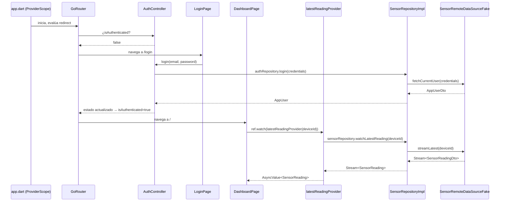

# Documento de Diseño — Panel de Monitoreo (MVP)

## Overview

Flutter Web con Riverpod (sin code generation) + go_router, siguiendo Clean Architecture
(domain / infrastructure / presentation) según `steering/architecture.md`. El MVP cubre
login simple, lectura en tiempo real de temperatura y humedad de suelo, histórico con
gráficas (`fl_chart`), y alertas visuales por rango configurable.

Mientras no exista backend real, **todo el acceso a datos pasa por implementaciones `Fake`**
en memoria. `SensorRemoteDataSourceFake` carga un JSON estático desde memoria (no genera
lecturas aleatorias). `AuthRemoteDataSourceFake` acepta un par usuario/contraseña fijos.
La sesión no persiste entre recargas con el fake — ese comportamiento es aceptable para el
MVP y quedará pendiente hasta que exista un backend real de autenticación.

El tema visual de la app es **oscuro** (paleta de verdes oscuros sobre fondos neutros oscuros, evocando vegetación), definido en un único archivo `core/config/app_theme.dart`. Todos los widgets consumen el tema a través de `Theme.of(context)`; ningún widget tiene colores hardcodeados.

---

## Architecture

### Capas

El proyecto sigue Clean Architecture en tres capas con dependencias unidireccionales:

```
presentation  →  domain  ←  infrastructure
```

- **`domain`**: entidades puras + contratos abstractos (`abstract class`). Sin imports de
  Flutter, sin JSON, sin paquetes externos.
- **`infrastructure`**: implementa los contratos de `domain`. Contiene los `DataSource`
  (contrato + implementaciones concretas) y los `RepositoryImpl` que mapean DTO → entidad.
- **`presentation`**: widgets + providers de Riverpod. Conoce `domain` (tipos) pero accede
  a `infrastructure` únicamente a través de providers — nunca instancia directamente un
  `RepositoryImpl` ni un `DataSource`.

### Estructura de carpetas relevante

```
lib/
  core/
    config/         # app_theme.dart — ThemeData oscuro centralizado
    error/          # AppFailure y subtipos
  domain/
    entities/       # SensorReading, AppUser, AlertThreshold
    repositories/   # SensorRepository, AuthRepository (abstract)
    failures/       # AuthFailure, NetworkFailure
  infrastructure/
    datasources/
      sensor/
        sensor_remote_datasource.dart          # contrato abstracto
        sensor_remote_datasource_fake.dart     # carga JSON estático
        sensor_remote_datasource_rest.dart     # (futuro)
      auth/
        auth_remote_datasource.dart            # contrato abstracto
        auth_remote_datasource_fake.dart       # credenciales fijas
    models/
      sensor_reading_dto.dart                  # fromJson / toJson / toEntity()
      app_user_dto.dart
    repositories/
      sensor_repository_impl.dart
      auth_repository_impl.dart
  presentation/
    router/
      app_router.dart     # GoRouter con redirect de auth
      app_routes.dart     # constantes de rutas
    providers/
      sensor/
        sensor_providers.dart   # latestReadingProvider, sensorHistoryProvider
        sensor_datasource_provider.dart
      auth/
        auth_providers.dart     # authControllerProvider, currentUserProvider
        auth_datasource_provider.dart
    pages/
      auth/
        login_page.dart
      dashboard/
        dashboard_page.dart
    widgets/
      sensor_value_card.dart   # muestra un valor + estado de alerta
      history_chart.dart       # gráfica fl_chart del histórico
  main.dart
  app.dart          # ProviderScope + MaterialApp.router
```

### Diagrama de flujo principal



### Cómo se intercambia el DataSource (el "switch" de proveedor)

El único lugar donde se elige la implementación concreta es un `Provider` de **Riverpod**
(no el paquete `provider`) en `infrastructure`:

```dart
// presentation/providers/sensor/sensor_datasource_provider.dart
final sensorRemoteDataSourceProvider = Provider<SensorRemoteDataSource>((ref) {
  return SensorRemoteDataSourceFake(); // ← cambiar aquí al conectar backend real
});

final sensorRepositoryProvider = Provider<SensorRepository>((ref) {
  return SensorRepositoryImpl(ref.watch(sensorRemoteDataSourceProvider));
});
```

Cambiar de proveedor = cambiar una línea. Nada en `domain` ni en `presentation` se modifica.

---

## Components and Interfaces

> **Nota sobre nomenclatura — Riverpod vs `provider`:**
> Todo el manejo de estado en este proyecto usa **Riverpod** (`flutter_riverpod`), NO el
> paquete `provider`. Riverpod tiene su propio tipo llamado `Provider<T>` que se usa para
> inyectar dependencias sin estado (repositorios, datasources), pero no tiene nada que ver
> con el paquete `provider`. Otros tipos de Riverpod usados en este proyecto:
>
> | Tipo Riverpod | Cuándo se usa |
> |---|---|
> | `Provider<T>` | Inyección de dependencias sin estado (repos, datasources, thresholds) |
> | `StreamProvider.family<T, Arg>` | Datos en tiempo real que llegan como `Stream` |
> | `FutureProvider.family<T, Arg>` | Consultas async puntuales (ej. histórico) |
> | `AsyncNotifierProvider<N, T>` | Estado mutable con lógica (ej. login/logout) |

### Entidades de dominio (`domain/entities/`)

```dart
// domain/entities/sensor_reading.dart
class SensorReading {
  final String deviceId;
  final double temperature;
  final double soilMoisture;
  final DateTime recordedAt;

  const SensorReading({
    required this.deviceId,
    required this.temperature,
    required this.soilMoisture,
    required this.recordedAt,
  });
}

// domain/entities/app_user.dart
class AppUser {
  final String id;
  final String email;

  const AppUser({required this.id, required this.email});
}

// domain/entities/alert_threshold.dart
// Rango saludable para UN tipo de sensor (temperatura O humedad de suelo).
// Los valores concretos se definen en alertThresholdProvider (hardcoded en el MVP).
class AlertThreshold {
  final double min;
  final double max;

  const AlertThreshold({required this.min, required this.max});

  /// Devuelve true si el valor está FUERA del rango saludable.
  bool isOutOfRange(double value) => value < min || value > max;
}
```

### Contratos de repositorio (`domain/repositories/`)

```dart
// domain/repositories/sensor_repository.dart
abstract class SensorRepository {
  /// Última lectura disponible (consulta puntual).
  Future<SensorReading> getLatestReading(String deviceId);

  /// Stream continuo de lecturas en tiempo real.
  Stream<SensorReading> watchLatestReading(String deviceId);

  /// Histórico en un rango de fechas.
  Future<List<SensorReading>> getHistory(String deviceId, DateTimeRange range);
}

// domain/repositories/auth_repository.dart
abstract class AuthRepository {
  /// Intenta autenticar. Lanza [AuthFailure] si falla.
  Future<AppUser> login(String email, String password);

  /// Cierra la sesión actual.
  Future<void> logout();

  /// Usuario actualmente autenticado, o null si no hay sesión.
  AppUser? get currentUser;

  /// Stream que emite cambios en el estado de autenticación.
  Stream<AppUser?> get authStateChanges;
}
```

### Contratos de DataSource (`infrastructure/datasources/`)

```dart
// infrastructure/datasources/sensor/sensor_remote_datasource.dart
abstract class SensorRemoteDataSource {
  Future<SensorReadingDto> fetchLatest(String deviceId);
  Stream<SensorReadingDto> streamLatest(String deviceId);
  Future<List<SensorReadingDto>> fetchHistory(String deviceId, DateTimeRange range);
}

// infrastructure/datasources/auth/auth_remote_datasource.dart
abstract class AuthRemoteDataSource {
  Future<AppUserDto> signIn(String email, String password);
  Future<void> signOut();
}
```

### Implementaciones Fake

```dart
// infrastructure/datasources/sensor/sensor_remote_datasource_fake.dart
//
// Carga datos desde un JSON estático en memoria (assets/fake_sensor_data.json).
// NO genera valores aleatorios. Los datos fijos permiten pruebas deterministas.
// El stream simula tiempo real emitiendo la lectura más reciente periódicamente.
class SensorRemoteDataSourceFake implements SensorRemoteDataSource {
  final List<SensorReadingDto> _data; // cargado desde JSON al inicializar

  SensorRemoteDataSourceFake(this._data);

  @override
  Future<SensorReadingDto> fetchLatest(String deviceId) async { ... }

  @override
  Stream<SensorReadingDto> streamLatest(String deviceId) async* { ... }

  @override
  Future<List<SensorReadingDto>> fetchHistory(
    String deviceId,
    DateTimeRange range,
  ) async { ... }
}

// infrastructure/datasources/auth/auth_remote_datasource_fake.dart
//
// Acepta las credenciales fijas definidas en una constante interna.
// No persiste sesión entre recargas — comportamiento esperado para el MVP fake.
class AuthRemoteDataSourceFake implements AuthRemoteDataSource {
  static const _fakeEmail = 'admin@huerto.local';
  static const _fakePassword = 'jitomate123';

  @override
  Future<AppUserDto> signIn(String email, String password) async {
    if (email == _fakeEmail && password == _fakePassword) {
      return AppUserDto(id: 'fake-user-1', email: email);
    }
    throw AuthFailure('Credenciales inválidas');
  }

  @override
  Future<void> signOut() async {}
}
```

### Implementaciones de repositorio (`infrastructure/repositories/`)

```dart
// infrastructure/repositories/sensor_repository_impl.dart
class SensorRepositoryImpl implements SensorRepository {
  final SensorRemoteDataSource _dataSource;
  SensorRepositoryImpl(this._dataSource);

  @override
  Future<SensorReading> getLatestReading(String deviceId) async {
    final dto = await _dataSource.fetchLatest(deviceId);
    return dto.toEntity();
  }

  @override
  Stream<SensorReading> watchLatestReading(String deviceId) =>
      _dataSource.streamLatest(deviceId).map((dto) => dto.toEntity());

  @override
  Future<List<SensorReading>> getHistory(
    String deviceId,
    DateTimeRange range,
  ) async {
    final dtos = await _dataSource.fetchHistory(deviceId, range);
    return dtos.map((dto) => dto.toEntity()).toList();
  }
}

// infrastructure/repositories/auth_repository_impl.dart
class AuthRepositoryImpl implements AuthRepository {
  final AuthRemoteDataSource _dataSource;
  AppUser? _currentUser;

  AuthRepositoryImpl(this._dataSource);

  @override
  Future<AppUser> login(String email, String password) async {
    final dto = await _dataSource.signIn(email, password);
    _currentUser = dto.toEntity();
    return _currentUser!;
  }

  @override
  Future<void> logout() async {
    await _dataSource.signOut();
    _currentUser = null;
  }

  @override
  AppUser? get currentUser => _currentUser;

  @override
  Stream<AppUser?> get authStateChanges => /* StreamController interno */;
}
```

### Providers de Riverpod (`presentation/providers/`)

```dart
// presentation/providers/auth/auth_providers.dart
final authRepositoryProvider = Provider<AuthRepository>((ref) {
  return AuthRepositoryImpl(ref.watch(authDataSourceProvider));
});

// AsyncNotifier que maneja login/logout y expone AsyncValue<AppUser?>
final authControllerProvider =
    AsyncNotifierProvider<AuthController, AppUser?>(() => AuthController());

// presentation/providers/sensor/sensor_providers.dart

// Última lectura en tiempo real (stream)
final latestReadingProvider = StreamProvider.autoDispose
    .family<SensorReading, String>((ref, deviceId) {
  return ref.watch(sensorRepositoryProvider).watchLatestReading(deviceId);
});

// Histórico por rango (consulta puntual)
final sensorHistoryProvider = FutureProvider.autoDispose
    .family<List<SensorReading>, ({String deviceId, DateTimeRange range})>(
        (ref, params) {
  return ref
      .watch(sensorRepositoryProvider)
      .getHistory(params.deviceId, params.range);
});

// Umbrales hardcodeados (no hay UI de configuración en el MVP)
final alertThresholdProvider = Provider<({AlertThreshold temperature, AlertThreshold soilMoisture})>((ref) {
  return (
    temperature: const AlertThreshold(min: 15.0, max: 35.0),
    soilMoisture: const AlertThreshold(min: 30.0, max: 80.0),
  );
});
```

### Router (`presentation/router/app_router.dart`)

```dart
// Constantes de rutas
class AppRoutes {
  static const login = '/login';
  static const dashboard = '/';
}

// GoRouter con guard de auth en redirect
final routerProvider = Provider<GoRouter>((ref) {
  final authNotifier = ref.watch(authControllerProvider.notifier);
  return GoRouter(
    refreshListenable: authNotifier, // notifica cambios de sesión al router
    redirect: (context, state) {
      final isLoggedIn = ref.read(authControllerProvider).valueOrNull != null;
      final goingToLogin = state.matchedLocation == AppRoutes.login;
      if (!isLoggedIn && !goingToLogin) return AppRoutes.login;
      if (isLoggedIn && goingToLogin) return AppRoutes.dashboard;
      return null;
    },
    routes: [
      GoRoute(path: AppRoutes.login, builder: (_, __) => const LoginPage()),
      GoRoute(path: AppRoutes.dashboard, builder: (_, __) => const DashboardPage()),
    ],
  );
});
```

### Tema visual (`core/config/app_theme.dart`)

El tema es el único punto de configuración visual de la app. No se usan colores ni estilos
dispersos en widgets individuales.

```dart
// core/config/app_theme.dart

import 'package:flutter/material.dart';

/// Paleta de colores del panel (dark mode, evocando vegetación).
abstract class AppColors {
  // Fondos
  static const background = Color(0xFF121212);      // fondo principal
  static const surface    = Color(0xFF1E1E1E);      // cards / paneles
  static const surfaceAlt = Color(0xFF2C2C2C);      // filas alternas, dividers

  // Primario — verde oscuro
  static const primary    = Color(0xFF388E3C);      // acento principal
  static const primaryLight = Color(0xFF66BB6A);    // hover / highlight

  // Estado
  static const warning    = Color(0xFFFFA726);      // alerta fuera de rango
  static const error      = Color(0xFFEF5350);      // error crítico
  static const ok         = Color(0xFF66BB6A);      // lectura en rango

  // Texto
  static const textPrimary   = Color(0xFFE0E0E0);
  static const textSecondary = Color(0xFF9E9E9E);
}

/// ThemeData listo para pasar a MaterialApp.router(theme: ...).
final appTheme = ThemeData(
  useMaterial3: true,
  brightness: Brightness.dark,
  colorScheme: const ColorScheme.dark(
    primary:   AppColors.primary,
    surface:   AppColors.surface,
    error:     AppColors.error,
    onPrimary: Colors.white,
    onSurface: AppColors.textPrimary,
  ),
  scaffoldBackgroundColor: AppColors.background,
  cardTheme: const CardThemeData(color: AppColors.surface),
  appBarTheme: const AppBarTheme(
    backgroundColor: AppColors.surface,
    foregroundColor: AppColors.textPrimary,
    elevation: 0,
  ),
  textTheme: const TextTheme(
    bodyLarge:  TextStyle(color: AppColors.textPrimary),
    bodyMedium: TextStyle(color: AppColors.textSecondary),
  ),
);
```

`app.dart` lo usa así:

```dart
MaterialApp.router(
  theme: appTheme,
  themeMode: ThemeMode.dark,
  routerConfig: ref.watch(routerProvider),
);
```

Cambiar la paleta completa = modificar `AppColors` en este único archivo.

### Widgets clave (`presentation/widgets/`)

```dart
// presentation/widgets/sensor_value_card.dart
//
// Recibe el valor numérico y el umbral; decide color/ícono de alerta
// sin conocer ni el repositorio ni los providers.
class SensorValueCard extends StatelessWidget {
  final String label;
  final double value;
  final String unit;
  final AlertThreshold threshold;

  const SensorValueCard({
    required this.label,
    required this.value,
    required this.unit,
    required this.threshold,
    super.key,
  });

  @override
  Widget build(BuildContext context) {
    final outOfRange = threshold.isOutOfRange(value);
    // color verde si ok, naranja/rojo si fuera de rango
    ...
  }
}
```

---

## Data Models

### DTOs (`infrastructure/models/`)

Los DTOs son los únicos objetos con lógica de JSON. Nunca entran a `domain` ni a
`presentation` directamente.

```dart
// infrastructure/models/sensor_reading_dto.dart
class SensorReadingDto {
  final String deviceId;
  final double temperature;
  final double soilMoisture;
  final String recordedAt; // ISO-8601

  const SensorReadingDto({
    required this.deviceId,
    required this.temperature,
    required this.soilMoisture,
    required this.recordedAt,
  });

  factory SensorReadingDto.fromJson(Map<String, dynamic> json) =>
      SensorReadingDto(
        deviceId: json['device_id'] as String,
        temperature: (json['temperature'] as num).toDouble(),
        soilMoisture: (json['soil_moisture'] as num).toDouble(),
        recordedAt: json['recorded_at'] as String,
      );

  Map<String, dynamic> toJson() => {
        'device_id': deviceId,
        'temperature': temperature,
        'soil_moisture': soilMoisture,
        'recorded_at': recordedAt,
      };

  SensorReading toEntity() => SensorReading(
        deviceId: deviceId,
        temperature: temperature,
        soilMoisture: soilMoisture,
        recordedAt: DateTime.parse(recordedAt),
      );
}

// infrastructure/models/app_user_dto.dart
class AppUserDto {
  final String id;
  final String email;

  const AppUserDto({required this.id, required this.email});

  factory AppUserDto.fromJson(Map<String, dynamic> json) =>
      AppUserDto(id: json['id'] as String, email: json['email'] as String);

  Map<String, dynamic> toJson() => {'id': id, 'email': email};

  AppUser toEntity() => AppUser(id: id, email: email);
}
```

### JSON estático del fake (`assets/fake_sensor_data.json`)

Formato de referencia para el archivo que carga `SensorRemoteDataSourceFake`:

```json
[
  {
    "device_id": "device-1",
    "temperature": 22.5,
    "soil_moisture": 55.0,
    "recorded_at": "2025-01-15T08:00:00Z"
  },
  {
    "device_id": "device-1",
    "temperature": 23.1,
    "soil_moisture": 53.2,
    "recorded_at": "2025-01-15T09:00:00Z"
  }
]
```

### AlertThreshold (valores del MVP)

| Sensor          | min  | max  | Unidad |
|-----------------|------|------|--------|
| Temperatura     | 15.0 | 35.0 | °C     |
| Humedad de suelo| 30.0 | 80.0 | %      |

Estos valores están hardcodeados en `alertThresholdProvider`. No hay UI de configuración
en el MVP. Para cambiarlos durante el MVP basta modificar ese provider.

---

## Correctness Properties

*Una propiedad es una característica o comportamiento que debe mantenerse verdadero en todas
las ejecuciones válidas del sistema — una especificación formal de lo que el sistema debe
hacer, verificable mediante pruebas automatizadas.*

### Property 1: Guard de autenticación

*Para cualquier* ruta protegida (distinta de `/login`), si el estado de auth es
`unauthenticated`, el `GoRouter` SIEMPRE debe redirigir a `/login` — sin importar qué ruta
se intente navegar.

**Validates: Requirements 1.1**

### Property 2: Lectura en tiempo real refleja el stream

*Para cualquier* secuencia de valores emitidos por `SensorRepository.watchLatestReading`,
el valor que muestra el dashboard en un momento dado debe ser igual al último valor
emitido por el stream en ese momento — nunca un valor anterior.

**Validates: Requirements 2.1, 2.2**

### Property 3: Estado de alerta es función pura del valor y el umbral

*Para cualquier* lectura `R` y umbral `T`, el estado de alerta calculado por
`AlertThreshold.isOutOfRange(value)` debe ser `true` **si y solo si**
`R.value < T.min OR R.value > T.max`. No hay estado intermedio ni casos no cubiertos.

Equivalentemente: intercambiar el `DataSource` no altera el resultado de esta función
para los mismos valores de entrada.

**Validates: Requirements 4.1, 4.2**

### Property 4: Intercambio de DataSource no cambia el comportamiento observable

*Para cualquier* par `(DataSource_A, DataSource_B)` que devuelvan los mismos datos de
dominio, reemplazar uno por el otro en el provider correspondiente produce el mismo
comportamiento en `domain` y en `presentation` — los widgets reciben los mismos
`SensorReading` y `AppUser`, y el router toma las mismas decisiones de redirección.

**Validates: Requirements 5.1, 5.2**

### Property 5: Round-trip de serialización de DTOs

*Para cualquier* instancia válida de `SensorReadingDto`, aplicar `toJson()` y luego
`SensorReadingDto.fromJson()` debe producir un objeto equivalente (mismos valores en todos
los campos).

**Validates: Requirements 5.2, 5.3**

### Property 6: El tema está centralizado (sin colores hardcodeados en widgets)

*Para cualquier* widget de la capa `presentation`, ningún `Color`, `TextStyle` ni valor de
estilo debe estar definido como literal en el widget. Todos los valores visuales deben
provenir de `Theme.of(context)` o de constantes exportadas por `core/config/app_theme.dart`.

**Validates: Requirements 6.3**

---

## Error Handling

### Tipos de error (`domain/failures/`)

```dart
// Clase base
sealed class AppFailure implements Exception {
  final String message;
  const AppFailure(this.message);
}

class AuthFailure extends AppFailure {
  const AuthFailure(super.message);
}

class NetworkFailure extends AppFailure {
  const NetworkFailure(super.message);
}

class NotFoundFailure extends AppFailure {
  const NotFoundFailure(super.message);
}
```

Se usan **excepciones tipadas + `try/catch` en los providers**, sin introducir
`Either<Failure, T>` (dartz/fpdart). Mantiene el código más sencillo dado el tamaño del
proyecto.

### Escenario 1: Credenciales inválidas

- **Condición**: `AuthRemoteDataSource.signIn` lanza `AuthFailure`.
- **Respuesta**: `AuthController` captura la excepción y expone
  `AsyncValue.error(AuthFailure(...))`.
- **UI**: `LoginPage` usa `.when(error:)` para mostrar el mensaje genérico
  *"Credenciales incorrectas"* sin revelar si el problema fue el usuario o la contraseña
  (Requisito 1.3).
- **Recuperación**: el formulario permanece activo para un nuevo intento.

### Escenario 2: Fuente de datos no responde (lecturas en tiempo real)

- **Condición**: `SensorRemoteDataSource.streamLatest` emite un error o cierra el stream
  inesperadamente.
- **Respuesta**: `latestReadingProvider` (`StreamProvider`) entra en estado `error`.
- **UI**: `DashboardPage` renderiza un `ErrorBanner` explícito con el mensaje de error.
  No se muestran datos congelados sin aviso (Requisito 2.3).
- **Recuperación**: el usuario puede forzar un refresh mediante `ref.invalidate(latestReadingProvider(...))`.

### Escenario 3: Sin datos en el rango histórico

- **Condición**: `SensorRepository.getHistory` devuelve lista vacía.
- **Respuesta**: `sensorHistoryProvider` resuelve con `[]`.
- **UI**: `HistoryChart` muestra un mensaje *"Sin datos para el rango seleccionado"* en vez
  de una gráfica vacía (Requisito 3.2).

### Escenario 4: Sesión no persiste (fake — comportamiento conocido)

- **Condición**: el usuario recarga la página con `AuthRemoteDataSourceFake` activo.
- **Respuesta**: `AuthRepositoryImpl._currentUser` es `null` al reiniciar la app.
- **UI**: el guard de auth redirige a `/login` automáticamente.
- **Nota**: este comportamiento es **aceptable para el MVP fake**. La persistencia de sesión
  (Requisito 1.4) quedará pendiente hasta que exista un backend real de autenticación.

---

## Testing Strategy

### Enfoque general

- **Pruebas unitarias**: cubren repositorios, datasources fake, mappers DTO↔entidad, y la
  lógica pura de `AlertThreshold`.
- **Pruebas de propiedades**: validan las propiedades universales definidas en la sección
  anterior (Propiedades 1–5), en especial round-trips de serialización y la lógica de
  umbral.
- Las pruebas de integración (con backend real) quedan fuera del scope del MVP fake.

### Pruebas unitarias prioritarias

| Componente | Qué verificar |
|---|---|
| `SensorRepositoryImpl` | delega al datasource, mapea DTO→entidad correctamente |
| `AuthRepositoryImpl` | login exitoso → `currentUser` != null; login fallido → lanza `AuthFailure` |
| `SensorRemoteDataSourceFake` | `fetchHistory` filtra por rango de fechas correctamente |
| `SensorReadingDto` | `fromJson`/`toJson`/`toEntity` con valores representativos |
| `AlertThreshold.isOutOfRange` | verdadero fuera de rango, falso dentro, en los límites exactos |
| `AuthController` | expone `AsyncValue.loading` durante el login, `error` en fallo |

### Pruebas de propiedad (property-based)

**Librería**: `package:test` + generadores manuales (el proyecto no requiere una librería
dedicada de PBT dado su tamaño; si se quisiera usar una, `dart_test_utils` o generadores
propios son suficientes).

| Propiedad | Estrategia |
|---|---|
| P3 — Estado de alerta | Generar `(double value, double min, double max)` aleatorios; verificar que `isOutOfRange(value) == (value < min \|\| value > max)` |
| P5 — Round-trip DTO | Generar `SensorReadingDto` con valores aleatorios; verificar `fromJson(toJson(dto)) == dto` |

### Pruebas de widget prioritarias

- `LoginPage`: formulario vacío no envía, error de auth se muestra, navegación tras login.
- `SensorValueCard`: color correcto para valor dentro/fuera de rango.
- `DashboardPage`: muestra `CircularProgressIndicator` en loading, `ErrorBanner` en error.

### Lo que NO se prueba en el MVP

- Comportamiento de `GoRouter` con redirecciones (requiere integración).
- Persistencia de sesión (pendiente hasta tener backend real).
- Renderizado visual de `fl_chart` (snapshot tests, fuera del scope inicial).

---

## Decisiones pendientes (no bloquean el MVP)

- **Proveedor final de persistencia y auth**: AWS IoT Core + DynamoDB, Firebase, o API REST
  propia. La arquitectura actual soporta cualquiera de los tres sin cambios en `domain` ni
  `presentation`.
- **Persistencia de sesión** (Requisito 1.4): requiere backend real. Con el fake, la sesión
  se pierde en cada recarga. Marcar como pendiente en tasks.md hasta que exista el backend.
- **Cálculo de alertas**: actualmente en el cliente (`AlertThreshold.isOutOfRange`). A
  futuro podría llegar ya calculado desde el backend; si ese cambio se hace, solo se
  modifica el `DataSource` y el `RepositoryImpl`.
- **Múltiples dispositivos**: `watchLatestReading(deviceId)` ya recibe un `deviceId`, por
  lo que añadir soporte para múltiples sensores no requiere cambios en los contratos.
