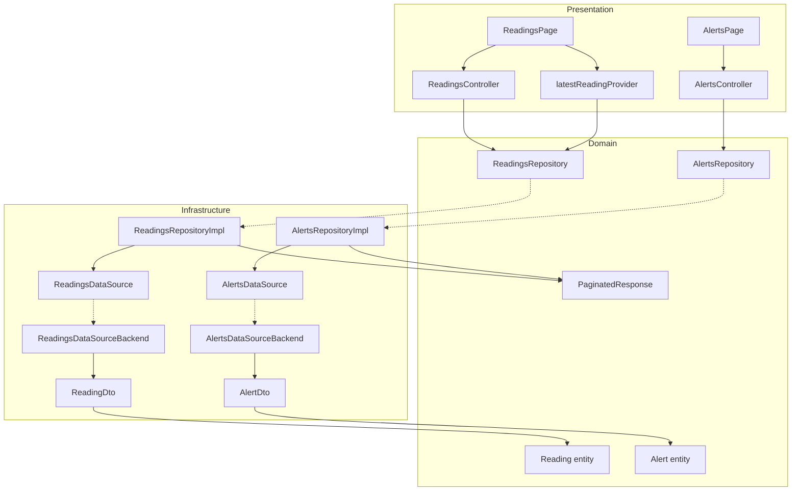

# Design Document: Readings and Alerts

## Overview

Este feature implementa las páginas de historial de lecturas (`/lecturas`) y alertas (`/alertas`) del panel IoT. Consume los endpoints REST paginados del backend (`GET /readings`, `GET /readings/latest`, `GET /alerts`) y presenta los datos en tablas con filtros interactivos, paginación tipo "load more", y distinción visual por tipo de alerta.

La arquitectura sigue el patrón existente del proyecto: entidades de dominio puras → repositorios abstractos → datasources con DTOs → implementaciones backend con Dio autenticado → providers de Riverpod que exponen estado reactivo a la UI. Se crean entidades y repositorios **separados** del `SensorRepository` existente (que sirve para streaming en tiempo real del dashboard).

### Decisiones clave

1. **PaginatedResponse\<T\> genérico**: estructura reutilizable para ambos endpoints paginados, evitando duplicación de lógica de parsing de paginación.
2. **Filter models inmutables**: `ReadingsFilter` y `AlertsFilter` como data classes que encapsulan los parámetros de filtro actuales, facilitando la comparación y el reset.
3. **Controllers como AsyncNotifiers**: manejan el estado completo de cada página (items acumulados, metadata de paginación, filtro actual, flag de "cargando más").
4. **Latest reading como FutureProvider separado**: se invalida cuando cambian los filtros del controller de lecturas.

## Architecture



### Flujo de datos

1. La UI llama a métodos del controller (applyFilters, loadMore).
2. El controller delega al repositorio abstracto pasando filtros + limit/offset.
3. El repositorio impl delega al datasource, recibe DTOs, mapea a entidades.
4. El controller acumula items (load more) o reemplaza (filter change).
5. La UI reacciona al `AsyncValue` del controller.

## Components and Interfaces

### Domain Layer

#### Entities

| Entity | Location | Responsibility |
|--------|----------|----------------|
| `Reading` | `domain/entities/reading.dart` | Modelo de dominio para una lectura histórica completa |
| `Alert` | `domain/entities/alert.dart` | Modelo de dominio para una alerta con contexto de umbrales |

#### Enums

| Enum | Location | Values |
|------|----------|--------|
| `AlertType` | `domain/entities/alert_type.dart` | `breach`, `recovery` |
| `BreachedBound` | `domain/entities/breached_bound.dart` | `minOk`, `maxOk` |
| `DeliveryStatus` | `domain/entities/delivery_status.dart` | `pending`, `sent`, `failed`, `skipped` |

#### Repositories (contratos)

| Contract | Location | Methods |
|----------|----------|---------|
| `ReadingsRepository` | `domain/repositories/readings_repository.dart` | `getReadings(...)`, `getLatestReading(...)` |
| `AlertsRepository` | `domain/repositories/alerts_repository.dart` | `getAlerts(...)` |

### Infrastructure Layer

#### DTOs

| DTO | Location |
|-----|----------|
| `ReadingDto` | `infrastructure/models/reading_dto.dart` |
| `AlertDto` | `infrastructure/models/alert_dto.dart` |

#### Generic Models

| Model | Location | Responsibility |
|-------|----------|----------------|
| `PaginatedResponse<T>` | `infrastructure/models/paginated_response.dart` | Encapsula items + metadata de paginación |

#### DataSources

| Contract | Implementation | Location |
|----------|---------------|----------|
| `ReadingsRemoteDataSource` | `ReadingsRemoteDataSourceBackend` | `infrastructure/datasources/readings/` |
| `AlertsRemoteDataSource` | `AlertsRemoteDataSourceBackend` | `infrastructure/datasources/alerts/` |

#### Repository Implementations

| Impl | Location |
|------|----------|
| `ReadingsRepositoryImpl` | `infrastructure/repositories/readings_repository_impl.dart` |
| `AlertsRepositoryImpl` | `infrastructure/repositories/alerts_repository_impl.dart` |

### Presentation Layer

#### Filter Models

| Model | Location | Fields |
|-------|----------|--------|
| `ReadingsFilter` | `presentation/providers/readings/readings_filter.dart` | `sensorId?`, `deviceId?`, `metric?`, `from?`, `to?` |
| `AlertsFilter` | `presentation/providers/readings/alerts_filter.dart` | `sensorId?`, `deviceId?`, `metric?`, `alertType?`, `from?`, `to?` |

#### Providers

| Provider | Type | Location |
|----------|------|----------|
| `readingsDataSourceProvider` | `Provider<ReadingsRemoteDataSource>` | `presentation/providers/readings/` |
| `readingsRepositoryProvider` | `Provider<ReadingsRepository>` | `presentation/providers/readings/` |
| `readingsControllerProvider` | `AsyncNotifierProvider<ReadingsController, ReadingsState>` | `presentation/providers/readings/` |
| `latestReadingProvider` | `FutureProvider.autoDispose<Reading?>` | `presentation/providers/readings/` |
| `alertsDataSourceProvider` | `Provider<AlertsRemoteDataSource>` | `presentation/providers/alerts/` |
| `alertsRepositoryProvider` | `Provider<AlertsRepository>` | `presentation/providers/alerts/` |
| `alertsControllerProvider` | `AsyncNotifierProvider<AlertsController, AlertsState>` | `presentation/providers/alerts/` |

#### Pages

| Page | Route | Responsibility |
|------|-------|----------------|
| `ReadingsPage` | `/lecturas` | Tabla de lecturas + filtros + latest card + load more |
| `AlertsPage` | `/alertas` | Tabla de alertas + filtros + color-coding + load more |

## Data Models

### Reading Entity

```dart
class Reading {
  final String id;
  final String sensorId;
  final String sensorName;
  final String deviceId;
  final MetricType metric;
  final String unit;
  final double value;
  final DateTime recordedAt;

  const Reading({
    required this.id,
    required this.sensorId,
    required this.sensorName,
    required this.deviceId,
    required this.metric,
    required this.unit,
    required this.value,
    required this.recordedAt,
  });
}
```

### Alert Entity

```dart
class Alert {
  final String id;
  final String sensorId;
  final String sensorName;
  final String deviceId;
  final MetricType metric;
  final String unit;
  final AlertType alertType;
  final double value;
  final BreachedBound? breachedBound;
  final double? minOk;
  final double? maxOk;
  final DateTime triggeredAt;
  final DeliveryStatus deliveryStatus;

  const Alert({
    required this.id,
    required this.sensorId,
    required this.sensorName,
    required this.deviceId,
    required this.metric,
    required this.unit,
    required this.alertType,
    required this.value,
    this.breachedBound,
    this.minOk,
    this.maxOk,
    required this.triggeredAt,
    required this.deliveryStatus,
  });
}
```

### Enums

```dart
enum AlertType {
  breach,
  recovery;

  static AlertType fromString(String value) => switch (value) {
    'breach' => AlertType.breach,
    'recovery' => AlertType.recovery,
    _ => AlertType.breach,
  };

  String toBackendString() => name;
}

enum BreachedBound {
  minOk,
  maxOk;

  static BreachedBound fromString(String value) => switch (value) {
    'min_ok' => BreachedBound.minOk,
    'max_ok' => BreachedBound.maxOk,
    _ => BreachedBound.minOk,
  };

  String toBackendString() => switch (this) {
    BreachedBound.minOk => 'min_ok',
    BreachedBound.maxOk => 'max_ok',
  };
}

enum DeliveryStatus {
  pending,
  sent,
  failed,
  skipped;

  static DeliveryStatus fromString(String value) => switch (value) {
    'pending' => DeliveryStatus.pending,
    'sent' => DeliveryStatus.sent,
    'failed' => DeliveryStatus.failed,
    'skipped' => DeliveryStatus.skipped,
    _ => DeliveryStatus.pending,
  };

  String toBackendString() => name;
}
```

### PaginatedResponse\<T\>

```dart
class PaginatedResponse<T> {
  final List<T> items;
  final int total;
  final int limit;
  final int offset;

  const PaginatedResponse({
    required this.items,
    required this.total,
    required this.limit,
    required this.offset,
  });

  bool get hasMore => offset + items.length < total;

  factory PaginatedResponse.fromJson(
    Map<String, dynamic> json,
    T Function(Map<String, dynamic>) itemParser,
  ) {
    final pagination = json['pagination'] as Map<String, dynamic>;
    final itemsList = json['items'] as List<dynamic>;
    return PaginatedResponse(
      items: itemsList
          .map((e) => itemParser(e as Map<String, dynamic>))
          .toList(),
      total: pagination['total'] as int,
      limit: pagination['limit'] as int,
      offset: pagination['offset'] as int,
    );
  }
}
```

### ReadingDto

```dart
class ReadingDto {
  final String id;
  final String sensorId;
  final String sensorName;
  final String deviceId;
  final String metric;
  final String unit;
  final double value;
  final String recordedAt;

  const ReadingDto({
    required this.id,
    required this.sensorId,
    required this.sensorName,
    required this.deviceId,
    required this.metric,
    required this.unit,
    required this.value,
    required this.recordedAt,
  });

  factory ReadingDto.fromJson(Map<String, dynamic> json) => ReadingDto(
        id: json['id'] as String,
        sensorId: json['sensor_id'] as String,
        sensorName: json['sensor_name'] as String,
        deviceId: json['device_id'] as String,
        metric: json['metric'] as String,
        unit: json['unit'] as String,
        value: (json['value'] as num).toDouble(),
        recordedAt: json['recorded_at'] as String,
      );

  Map<String, dynamic> toJson() => {
        'id': id,
        'sensor_id': sensorId,
        'sensor_name': sensorName,
        'device_id': deviceId,
        'metric': metric,
        'unit': unit,
        'value': value,
        'recorded_at': recordedAt,
      };

  Reading toEntity() => Reading(
        id: id,
        sensorId: sensorId,
        sensorName: sensorName,
        deviceId: deviceId,
        metric: MetricType.fromString(metric),
        unit: unit,
        value: value,
        recordedAt: DateTime.parse(recordedAt),
      );
}
```

### AlertDto

```dart
class AlertDto {
  final String id;
  final String sensorId;
  final String sensorName;
  final String deviceId;
  final String metric;
  final String unit;
  final String alertType;
  final double value;
  final String? breachedBound;
  final double? minOk;
  final double? maxOk;
  final String triggeredAt;
  final String deliveryStatus;

  const AlertDto({
    required this.id,
    required this.sensorId,
    required this.sensorName,
    required this.deviceId,
    required this.metric,
    required this.unit,
    required this.alertType,
    required this.value,
    this.breachedBound,
    this.minOk,
    this.maxOk,
    required this.triggeredAt,
    required this.deliveryStatus,
  });

  factory AlertDto.fromJson(Map<String, dynamic> json) => AlertDto(
        id: json['id'] as String,
        sensorId: json['sensor_id'] as String,
        sensorName: json['sensor_name'] as String,
        deviceId: json['device_id'] as String,
        metric: json['metric'] as String,
        unit: json['unit'] as String,
        alertType: json['alert_type'] as String,
        value: (json['value'] as num).toDouble(),
        breachedBound: json['breached_bound'] as String?,
        minOk: (json['min_ok'] as num?)?.toDouble(),
        maxOk: (json['max_ok'] as num?)?.toDouble(),
        triggeredAt: json['triggered_at'] as String,
        deliveryStatus: json['delivery_status'] as String,
      );

  Map<String, dynamic> toJson() => {
        'id': id,
        'sensor_id': sensorId,
        'sensor_name': sensorName,
        'device_id': deviceId,
        'metric': metric,
        'unit': unit,
        'alert_type': alertType,
        'value': value,
        'breached_bound': breachedBound,
        'min_ok': minOk,
        'max_ok': maxOk,
        'triggered_at': triggeredAt,
        'delivery_status': deliveryStatus,
      };

  Alert toEntity() => Alert(
        id: id,
        sensorId: sensorId,
        sensorName: sensorName,
        deviceId: deviceId,
        metric: MetricType.fromString(metric),
        unit: unit,
        alertType: AlertType.fromString(alertType),
        value: value,
        breachedBound: breachedBound != null
            ? BreachedBound.fromString(breachedBound!)
            : null,
        minOk: minOk,
        maxOk: maxOk,
        triggeredAt: DateTime.parse(triggeredAt),
        deliveryStatus: DeliveryStatus.fromString(deliveryStatus),
      );
}
```

### Filter Models

```dart
class ReadingsFilter {
  final String? sensorId;
  final String? deviceId;
  final MetricType? metric;
  final DateTime? from;
  final DateTime? to;

  const ReadingsFilter({
    this.sensorId,
    this.deviceId,
    this.metric,
    this.from,
    this.to,
  });

  ReadingsFilter copyWith({
    String? sensorId,
    String? deviceId,
    MetricType? metric,
    DateTime? from,
    DateTime? to,
    bool clearSensorId = false,
    bool clearDeviceId = false,
    bool clearMetric = false,
    bool clearFrom = false,
    bool clearTo = false,
  }) => ReadingsFilter(
    sensorId: clearSensorId ? null : (sensorId ?? this.sensorId),
    deviceId: clearDeviceId ? null : (deviceId ?? this.deviceId),
    metric: clearMetric ? null : (metric ?? this.metric),
    from: clearFrom ? null : (from ?? this.from),
    to: clearTo ? null : (to ?? this.to),
  );

  Map<String, String> toQueryParams() {
    final params = <String, String>{};
    if (sensorId != null) params['sensor_id'] = sensorId!;
    if (deviceId != null) params['device_id'] = deviceId!;
    if (metric != null) params['metric'] = metric!.toBackendString();
    if (from != null) params['from'] = from!.toIso8601String();
    if (to != null) params['to'] = to!.toIso8601String();
    return params;
  }
}

class AlertsFilter {
  final String? sensorId;
  final String? deviceId;
  final MetricType? metric;
  final AlertType? alertType;
  final DateTime? from;
  final DateTime? to;

  const AlertsFilter({
    this.sensorId,
    this.deviceId,
    this.metric,
    this.alertType,
    this.from,
    this.to,
  });

  AlertsFilter copyWith({
    String? sensorId,
    String? deviceId,
    MetricType? metric,
    AlertType? alertType,
    DateTime? from,
    DateTime? to,
    bool clearSensorId = false,
    bool clearDeviceId = false,
    bool clearMetric = false,
    bool clearAlertType = false,
    bool clearFrom = false,
    bool clearTo = false,
  }) => AlertsFilter(
    sensorId: clearSensorId ? null : (sensorId ?? this.sensorId),
    deviceId: clearDeviceId ? null : (deviceId ?? this.deviceId),
    metric: clearMetric ? null : (metric ?? this.metric),
    alertType: clearAlertType ? null : (alertType ?? this.alertType),
    from: clearFrom ? null : (from ?? this.from),
    to: clearTo ? null : (to ?? this.to),
  );

  Map<String, String> toQueryParams() {
    final params = <String, String>{};
    if (sensorId != null) params['sensor_id'] = sensorId!;
    if (deviceId != null) params['device_id'] = deviceId!;
    if (metric != null) params['metric'] = metric!.toBackendString();
    if (alertType != null) params['alert_type'] = alertType!.toBackendString();
    if (from != null) params['from'] = from!.toIso8601String();
    if (to != null) params['to'] = to!.toIso8601String();
    return params;
  }
}
```

### Controller State Models (Presentation layer, not persisted)

```dart
class ReadingsState {
  final List<Reading> items;
  final int total;
  final int limit;
  final int offset;
  final ReadingsFilter filter;
  final bool isLoadingMore;

  const ReadingsState({
    this.items = const [],
    this.total = 0,
    this.limit = 50,
    this.offset = 0,
    this.filter = const ReadingsFilter(),
    this.isLoadingMore = false,
  });

  bool get hasMore => offset + items.length < total;

  ReadingsState copyWith({
    List<Reading>? items,
    int? total,
    int? limit,
    int? offset,
    ReadingsFilter? filter,
    bool? isLoadingMore,
  }) => ReadingsState(
    items: items ?? this.items,
    total: total ?? this.total,
    limit: limit ?? this.limit,
    offset: offset ?? this.offset,
    filter: filter ?? this.filter,
    isLoadingMore: isLoadingMore ?? this.isLoadingMore,
  );
}

class AlertsState {
  final List<Alert> items;
  final int total;
  final int limit;
  final int offset;
  final AlertsFilter filter;
  final bool isLoadingMore;

  const AlertsState({
    this.items = const [],
    this.total = 0,
    this.limit = 50,
    this.offset = 0,
    this.filter = const AlertsFilter(),
    this.isLoadingMore = false,
  });

  bool get hasMore => offset + items.length < total;

  AlertsState copyWith({
    List<Alert>? items,
    int? total,
    int? limit,
    int? offset,
    AlertsFilter? filter,
    bool? isLoadingMore,
  }) => AlertsState(
    items: items ?? this.items,
    total: total ?? this.total,
    limit: limit ?? this.limit,
    offset: offset ?? this.offset,
    filter: filter ?? this.filter,
    isLoadingMore: isLoadingMore ?? this.isLoadingMore,
  );
}
```


## Correctness Properties

*A property is a characteristic or behavior that should hold true across all valid executions of a system—essentially, a formal statement about what the system should do. Properties serve as the bridge between human-readable specifications and machine-verifiable correctness guarantees.*

### Property 1: ReadingDto round-trip serialization

*For any* valid ReadingDto instance (with arbitrary id, sensorId, sensorName, deviceId, metric string, unit, value, and ISO-8601 recordedAt), calling `toJson()` then `ReadingDto.fromJson()` then `toJson()` again SHALL produce an identical JSON map.

**Validates: Requirements 1.2, 1.3, 1.4**

### Property 2: AlertDto round-trip serialization

*For any* valid AlertDto instance (with arbitrary field values including nullable breachedBound, minOk, maxOk), calling `toJson()` then `AlertDto.fromJson()` then `toJson()` again SHALL produce an identical JSON map.

**Validates: Requirements 2.2, 2.3, 2.4**

### Property 3: Alert enum round-trip

*For any* value of `AlertType`, `BreachedBound`, or `DeliveryStatus`, calling `toBackendString()` followed by the corresponding `fromString()` SHALL return the original enum value.

**Validates: Requirements 3.1, 3.2, 3.3**

### Property 4: PaginatedResponse parsing preserves items and metadata

*For any* valid JSON structure with an `items` array of N elements and a `pagination` object containing `total`, `limit`, and `offset` integers, `PaginatedResponse.fromJson()` SHALL produce an instance where `items.length == N`, and `total`, `limit`, `offset` match the input JSON values exactly.

**Validates: Requirements 4.1, 4.2**

### Property 5: PaginatedResponse hasMore correctness

*For any* PaginatedResponse with `offset`, `items.length`, and `total` values, the `hasMore` property SHALL return `true` if and only if `offset + items.length < total`.

**Validates: Requirements 4.3**

### Property 6: Filter change resets pagination

*For any* paginated controller (readings or alerts) holding N existing items at a non-zero offset, applying a new filter SHALL result in `offset == 0` and replace the existing items list with fresh results from the first page.

**Validates: Requirements 9.3, 11.3, 12.3, 13.3**

### Property 7: Load more appends without replacing

*For any* paginated controller (readings or alerts) holding N existing items where `hasMore` is true, calling `loadMore` SHALL result in a new items list of length `N + newItems.length` where the first N items are identical to the previous items list (preserving order).

**Validates: Requirements 9.7, 11.8, 12.3, 13.3**

## Error Handling

### Network Errors

| Scenario | Handling | User Feedback |
|----------|----------|---------------|
| Timeout / no connectivity | `DioException` → `NetworkFailure` | "Error de red. Verifica tu conexión." + botón Reintentar |
| 404 on `/readings/latest` | `DioException` 404 → `NotFoundFailure` | Card muestra "Sin datos para estos filtros" |
| 500 server error | `DioException` → `NetworkFailure` | Mismo mensaje genérico de red + Reintentar |

### State Error Handling

- **Controller loading state**: Usa `AsyncValue.loading()` durante la carga inicial. El `isLoadingMore` flag en el state model distingue "carga inicial" de "cargando más".
- **Load more failure**: No reemplaza items existentes. Muestra snackbar/toast con error y restaura `isLoadingMore = false`. El usuario puede reintentar.
- **Filter change failure**: Reemplaza estado con `AsyncError`. Muestra error con Reintentar (que vuelve a aplicar los mismos filtros).

### Data Validation

- DTOs usan cast directo (`as String`, `as num`) que lanza `TypeError` si el backend manda un tipo inesperado. El controller captura cualquier excepción y la expone como `AsyncError`.
- Valores `null` en campos nullable (breachedBound, minOk, maxOk) se manejan con `as String?` / `as num?`.

## Testing Strategy

### Unit Tests (example-based)

| Area | What to test | Count |
|------|-------------|-------|
| Entities | Constructor, field access | 2 tests (Reading, Alert) |
| Enums | fromString con strings válidos e inválidos, fallback a default | 6 tests |
| PaginatedResponse | hasMore con edge cases (0 items, full page, exact total) | 3 tests |
| Filter models | toQueryParams con filtros parciales, copyWith, clear flags | 4 tests |
| DataSource backend | Mock Dio responses (200 success, 404, network error) | 6 tests |
| Repository impl | Delegation + DTO→Entity mapping | 3 tests |
| Controllers | Initial load, applyFilters, loadMore, error recovery | 6 tests |

### Property-Based Tests (universal properties)

Se usará **`dart_quickcheck`** (o alternativamente `glados`) como librería de PBT para Dart.

Cada test debe correr un **mínimo de 100 iteraciones** y llevar un comentario con el tag del property.

| Property | Iterations | Tag |
|----------|-----------|-----|
| ReadingDto round-trip | 100 | `Feature: readings-and-alerts, Property 1: ReadingDto round-trip serialization` |
| AlertDto round-trip | 100 | `Feature: readings-and-alerts, Property 2: AlertDto round-trip serialization` |
| Enum round-trip | 100 | `Feature: readings-and-alerts, Property 3: Alert enum round-trip` |
| PaginatedResponse parsing | 100 | `Feature: readings-and-alerts, Property 4: PaginatedResponse parsing` |
| hasMore correctness | 100 | `Feature: readings-and-alerts, Property 5: hasMore correctness` |
| Filter resets offset | 100 | `Feature: readings-and-alerts, Property 6: Filter change resets pagination` |
| Load more appends | 100 | `Feature: readings-and-alerts, Property 7: Load more appends without replacing` |

### Widget Tests

| Page | What to verify |
|------|---------------|
| ReadingsPage | Renders table with mock data, filter controls present, loading state, error state with retry, load more button visibility |
| AlertsPage | Renders table, color-coding per alertType, breach bound display, filters present, loading/error states |
| Latest reading card | Renders with data, "sin datos" on null, loading placeholder |

### Integration Tests (optional, for full-stack verification)

- E2E con backend real: verify happy path of paginated fetching con filtros reales.
- Not required for this spec's scope but recommended when backend is deployed.
